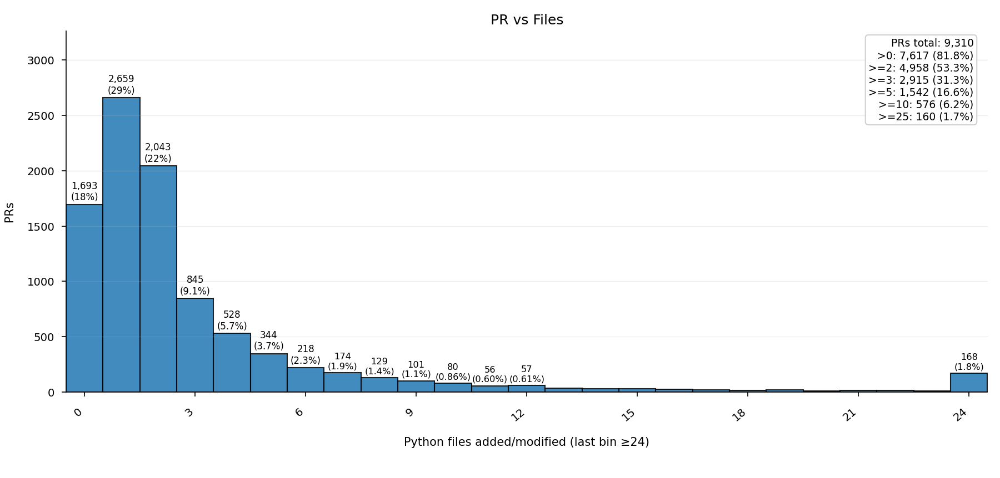
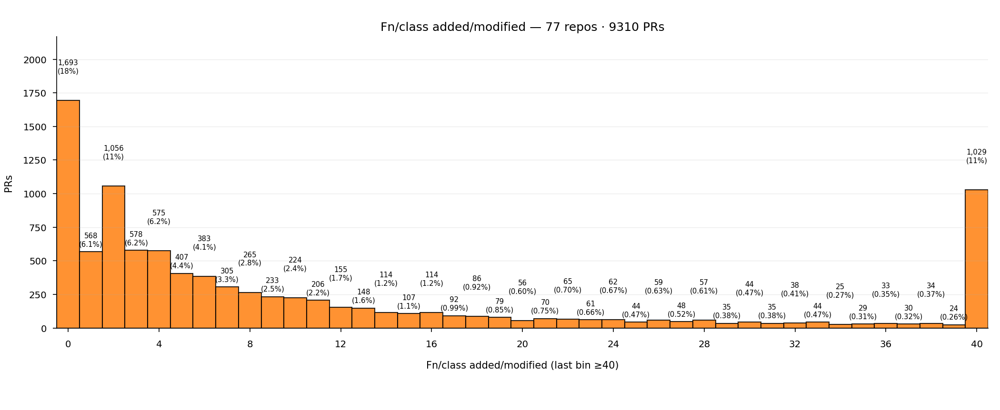
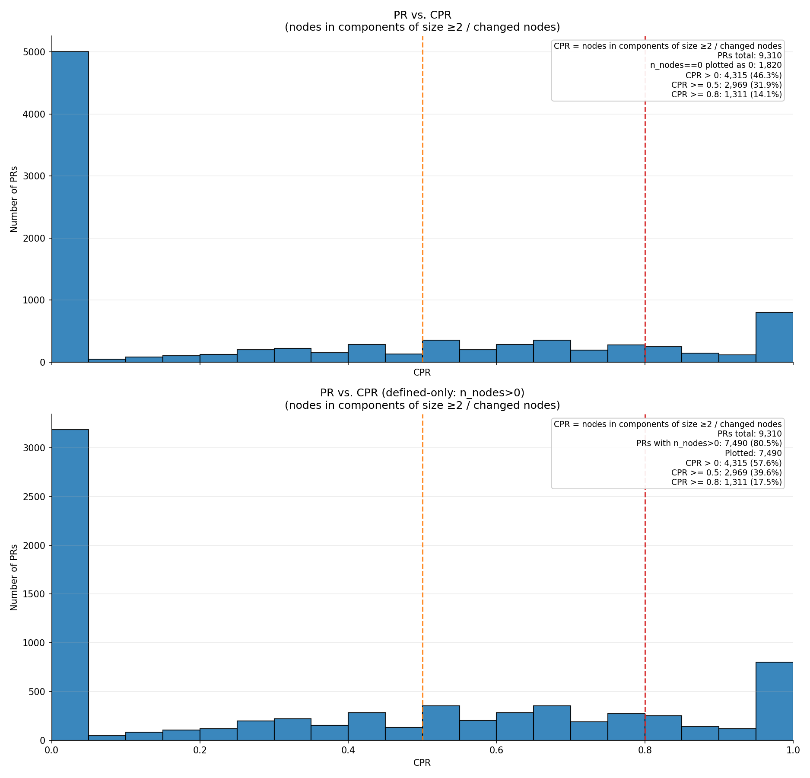
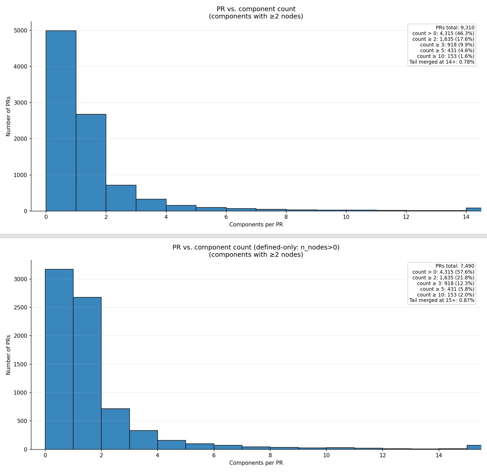
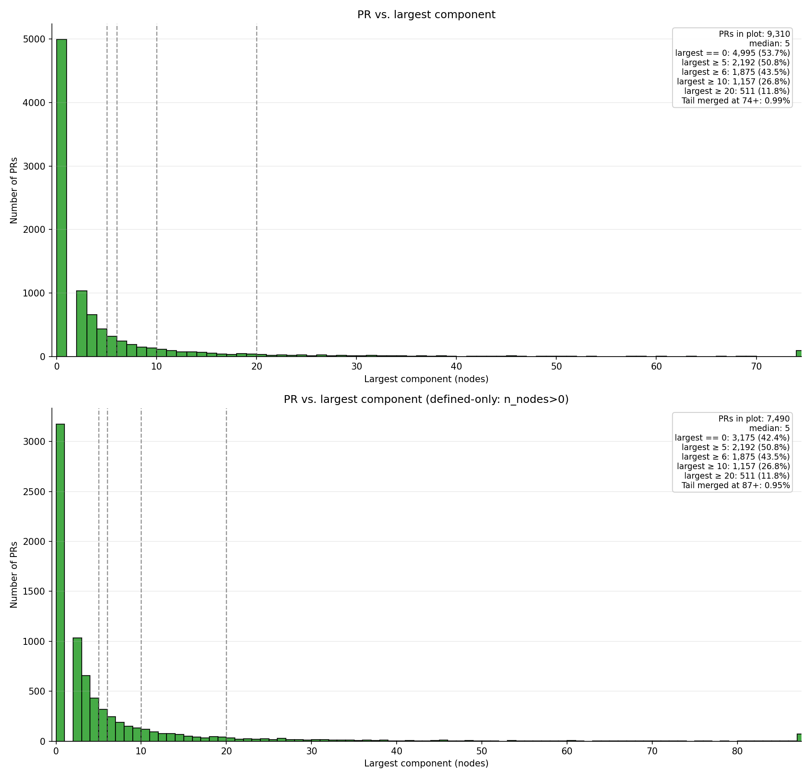
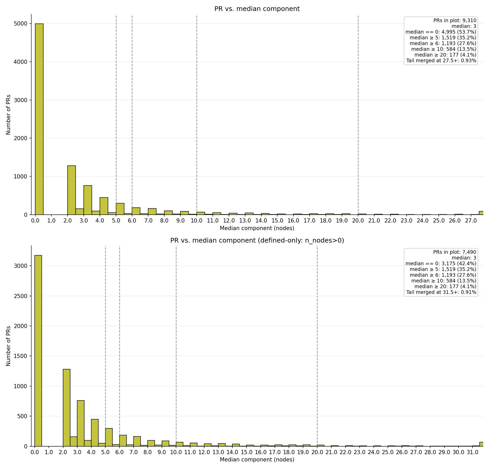
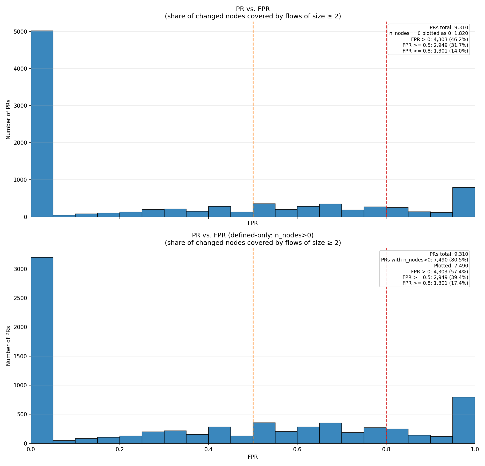
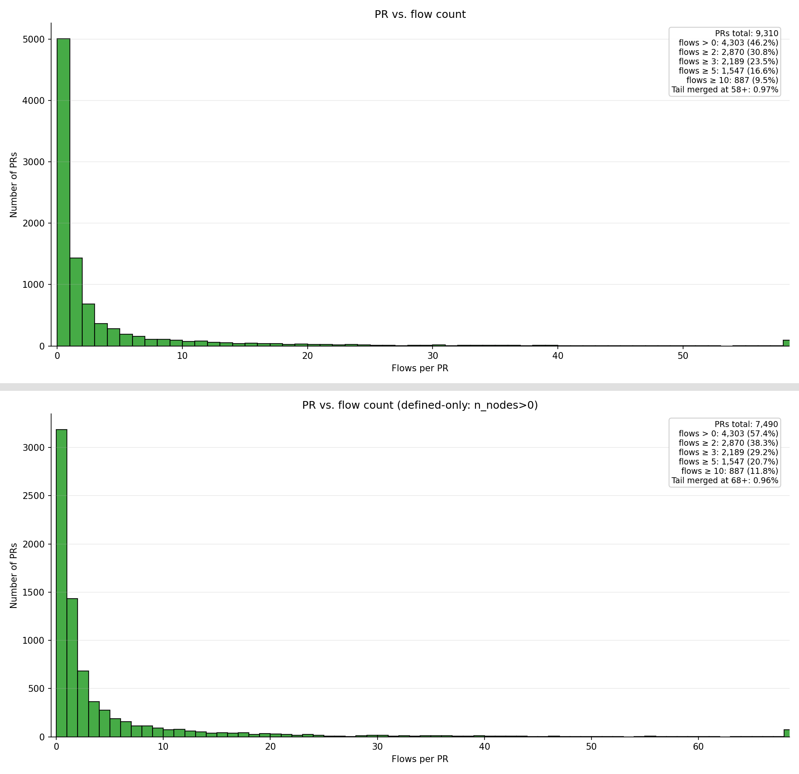
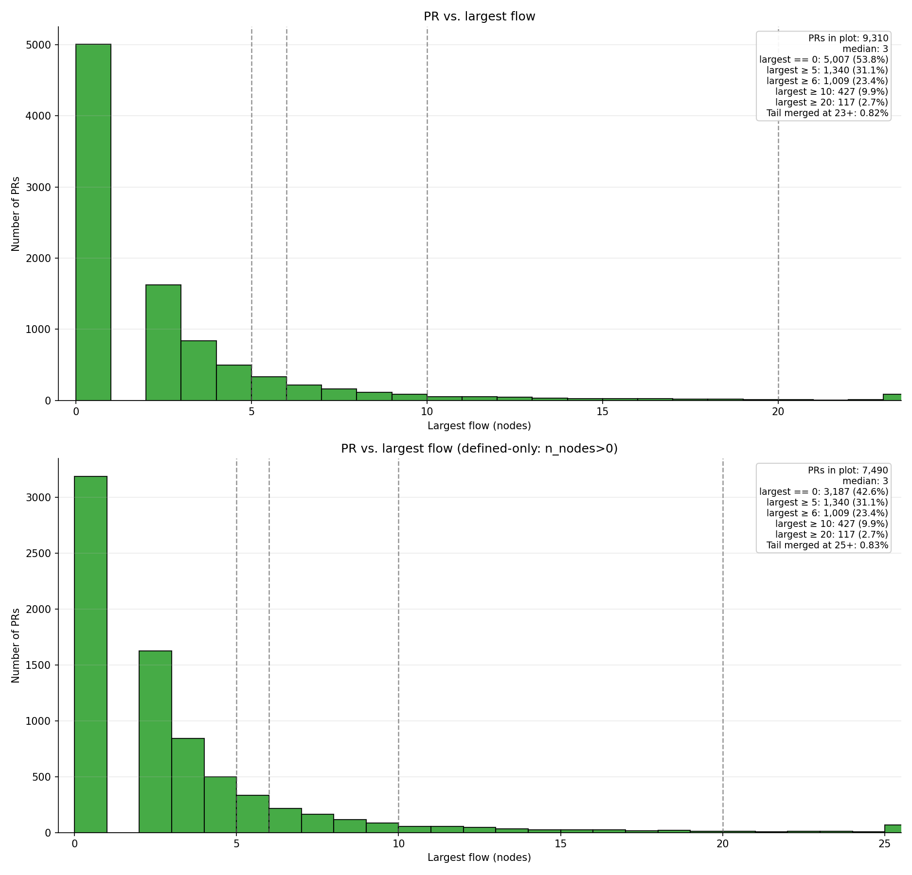
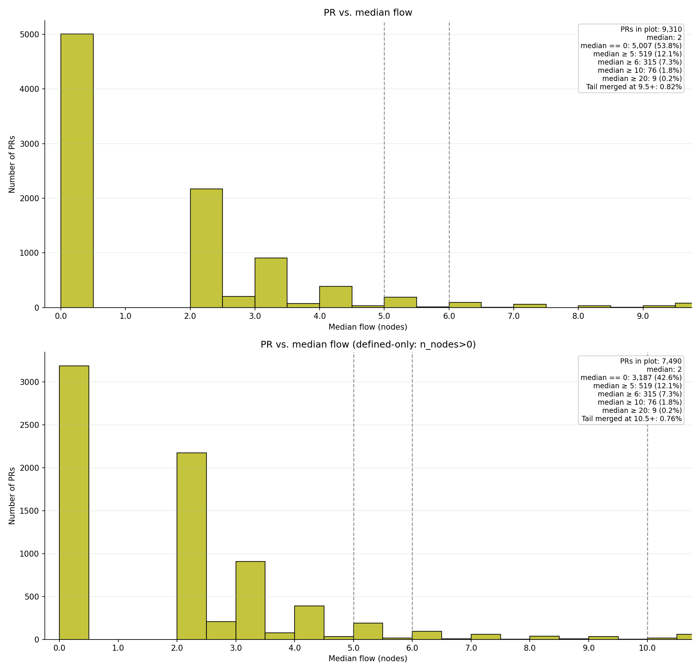

## Plots

1) PR vs. Files and PR vs. Functions

---

---

### Connected components

2) PR vs. CPR  
(CPR = nodes in components of size ≥2 / changed nodes)

---

3) PR vs. Conneceted Component Count (size ≥ 2)

---

4) PR vs. Largest Connected Component Size

---

5) PR vs. Median Connected Component Size

---

### Flows

6) PR vs. FPR  
(share of changed nodes covered by flows of size ≥ 2)

---

7) PR vs. Flow count

---

8) PR vs. Largest Flow Size

---

9) PR vs. Median Flow Size

