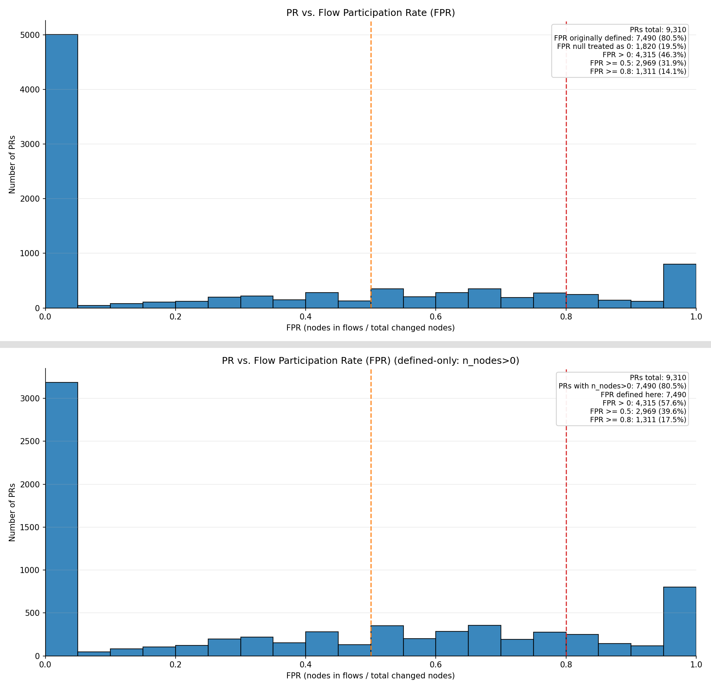
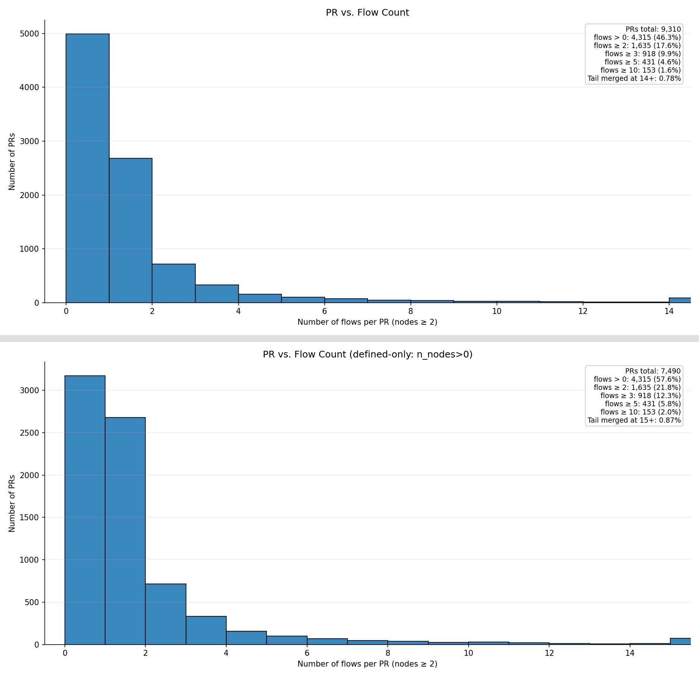
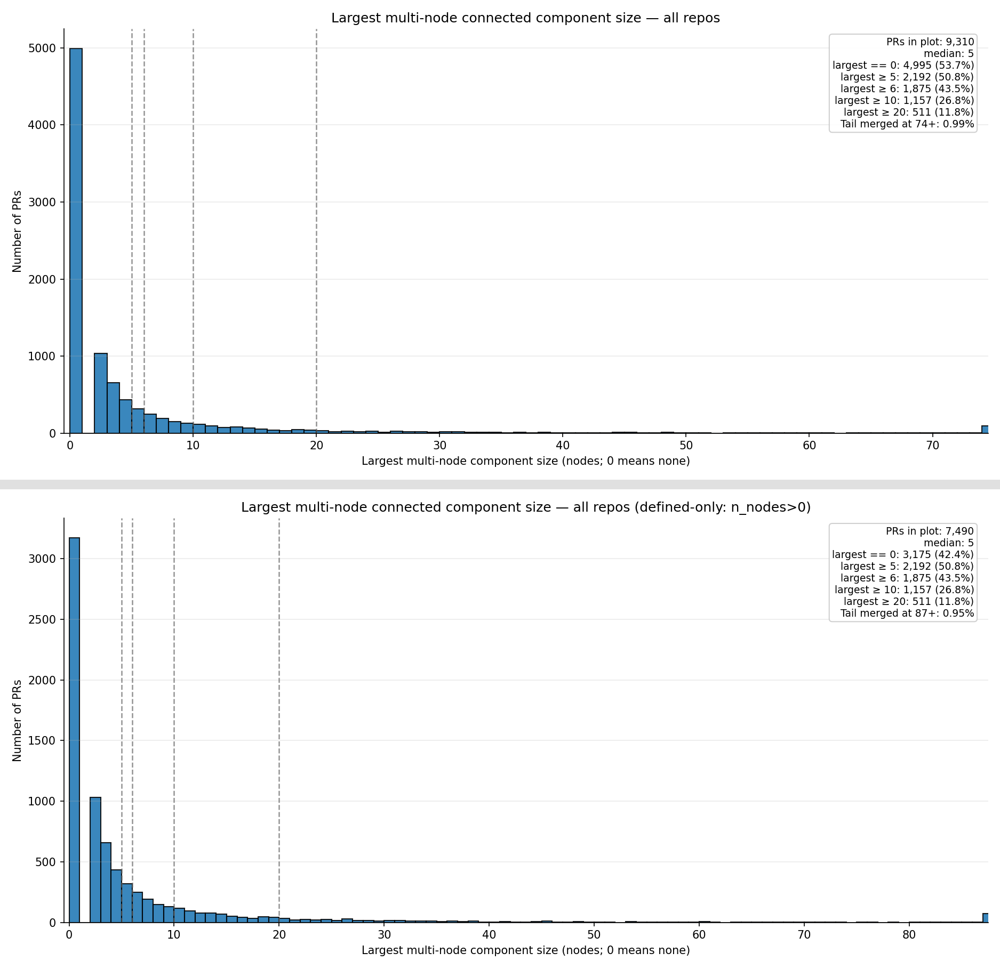
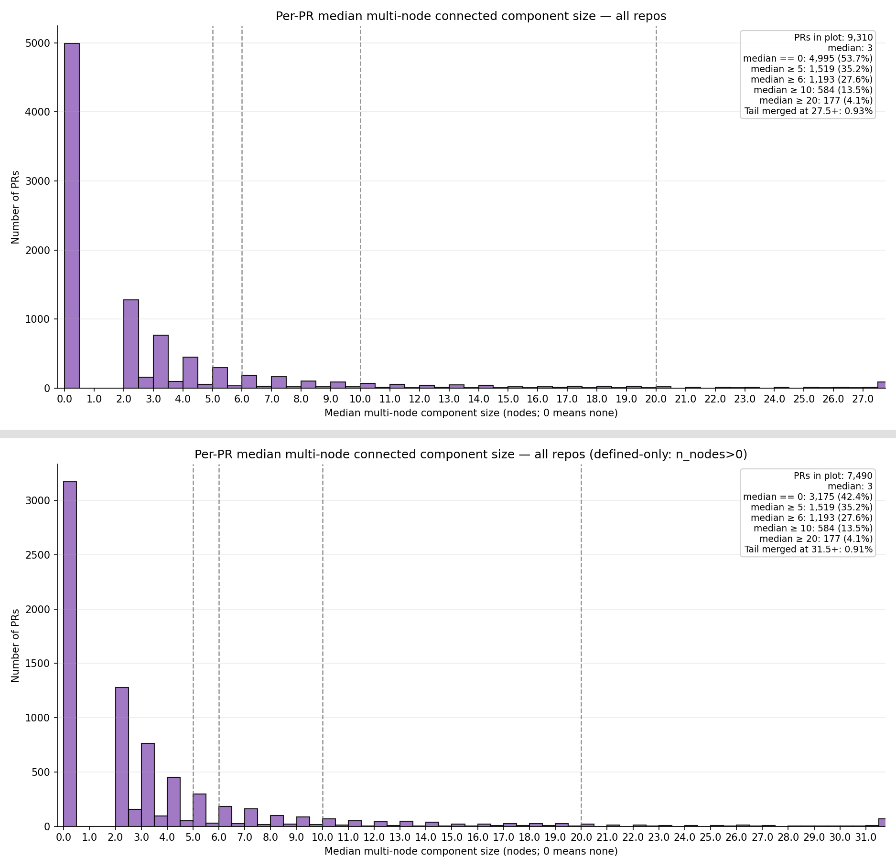

## Plots

1) PR vs. Files and PR vs. Functions

---

---

2) PR vs. Connectivity Participation Ratio (CPR)  

---

3) PR vs. Component Count

---

4) PR vs. Largest Component Size 

--- 

5) PR vs. Median Component Size
